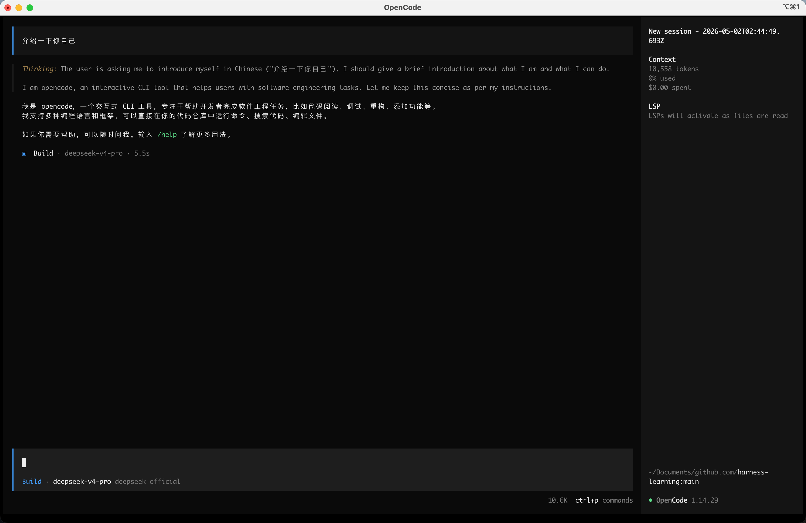

# Harness Learning — Week 1 · Chapter 01

---

## 任务 1：安装 OpenCode 并完成环境配置

### 目标

安装 OpenCode（参考 [GitHub README](https://github.com/anomalyco/opencode)），配置国产模型 API（推荐 DeepSeek，也可选 Qwen / GLM / Kimi），并通过 `opencode --version` 和首次成功对话截图完成验证。

### 验证结果

**版本号：**

```bash
➜  harness-learning git:(main) ✗ opencode --version
1.14.31
```

**首次对话截图：**



---

## 任务 2：对比实验 — 裸 API 调用 vs OpenCode 编排

### 目标

用 Python 直接调用模型 API 完成一个小任务（如分析一段代码），再用 OpenCode 完成同一个任务。对比两者差异，写一段约 200 字的体会：什么是"无状态"和"有状态"？

### 体会

使用 Python 直接调用模型 API 来分析代码，属于**无状态**任务。每次请求都是一次性交互——模型给出回复，会话即告结束。没有任何对话历史被保留，若想继续深入探讨，必须手动将全部上下文重新拼接进下一次请求。这本质上是一个"问一句、答一句、然后遗忘"的过程。

使用 OpenCode 来分析代码，属于**有状态**任务。OpenCode 作为 Coding Agent，一方面省去了编写 API 调用脚本的繁琐（声明式配置即可），更重要的是它实现了**短期记忆**（当前会话上下文）与**长期记忆**（Spec 文件、项目配置等）的统一管理，支持真正的多轮对话。你可以在连续交互中不断深挖代码分析的结论，Agent 还能自主调用工具（读取文件、执行命令、搜索代码）去获取更丰富的实时上下文——这些是单次裸 API 调用永远做不到的。

两者的本质区别是**连续性**与**能动性**：裸 API 给你一个答案然后忘记你；OpenCode 维持着一个不断累积理解的工作上下文。

---

## 任务 3：阅读 OpenCode 源码中的编排循环（选学）

### 目标

找到 OpenCode 源码中的主循环（Agent Loop），理解其如何实现 **观察 → 思考 → 行动 → 更新状态** 的闭环，并分享关键代码片段。

### 关键代码片段

以下 Go 代码（位于 `internal/agent`）是 OpenCode 的核心编排循环：

```go
for {
	// Check for cancellation before each iteration
	select {
	case <-ctx.Done():
		return a.err(ctx.Err())
	default:
		// Continue processing
	}

	agentMessage, toolResults, err := a.streamAndHandleEvents(ctx, sessionID, msgHistory)
	if err != nil {
		if errors.Is(err, context.Canceled) {
			agentMessage.AddFinish(message.FinishReasonCanceled)
			a.messages.Update(context.Background(), agentMessage)
			return a.err(ErrRequestCancelled)
		}
		return a.err(fmt.Errorf("failed to process events: %w", err))
	}

	if cfg.Debug {
		seqId := (len(msgHistory) + 1) / 2
		toolResultFilepath := logging.WriteToolResultsJson(sessionID, seqId, toolResults)
		logging.Info("Result", "message", agentMessage.FinishReason(), "toolResults", "{}", "filepath", toolResultFilepath)
	} else {
		logging.Info("Result", "message", agentMessage.FinishReason(), "toolResults", toolResults)
	}

	if (agentMessage.FinishReason() == message.FinishReasonToolUse) && toolResults != nil {
		// We are not done — respond with tool results and loop again
		msgHistory = append(msgHistory, agentMessage, *toolResults)
		continue
	}

	return AgentEvent{
		Type:    AgentEventTypeResponse,
		Message: agentMessage,
		Done:    true,
	}
}
```

### 循环分析

该循环与 Agent 决策周期的对应关系如下：

| 阶段 | 对应实现 |
|------|---------|
| **观察** | `streamAndHandleEvents()` 流式读取模型响应，其中可能包含工具调用请求或最终回答。上一轮的 `toolResults` 已存在于 `msgHistory` 中。 |
| **思考** | LLM 基于完整对话历史（`msgHistory`）判断：是给出最终答案，还是发起工具调用。 |
| **行动** | 若返回 `FinishReasonToolUse`，说明 Agent 发起了工具调用；框架执行这些调用并生成 `toolResults`。 |
| **更新状态** | `msgHistory = append(msgHistory, agentMessage, *toolResults)` 将助手消息与工具结果一并追加到对话历史中，然后 `continue` 回到循环顶部，将扩充后的上下文喂给下一次 LLM 调用。 |

循环仅在模型返回非工具型的最终响应时退出（`Done: true`），意味着 Agent 已完成全部推理链路，无需再采取进一步行动。
